# ReceiptLine

Markdown for receipts. Printable digital receipts. &#x1f9fe;  
Generate receipt printer commands and images.  

|Package|Type|For|Description|
|---|---|---|---|
|[ReceiptLine](https://www.npmjs.com/package/receiptline)|SDK for **Node.js**|Developers|Receipt description language processor|
|[ReceiptIO](https://www.npmjs.com/package/receiptio)|Node.js Console App|Users|Print, Convert, Printer status|
|[Designer](https://receiptline.github.io/designer/)|Tool|All|Edit, Preview|
|[Receipt Markdown](https://marketplace.visualstudio.com/items?itemName=receiptline.receipt-markdown)|VS Code Extension|All|Edit, Preview|
|[Receipt.js](https://github.com/receiptline/receiptjs)|SDK for **JavaScript**|Developers|Receipt description language processor<br>Print, Convert, Printer status|
|[Receipt.js Designer](https://receiptline.github.io/receiptjs-designer/)|Tool|All|Edit, Preview, **Print**|

"ReceiptLine" is a coined word from "Receipt" and "Streamline".  
Make it more efficient by making it simpler!  

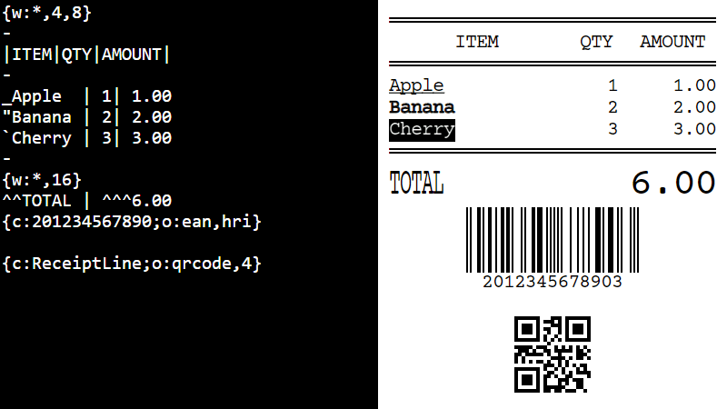  
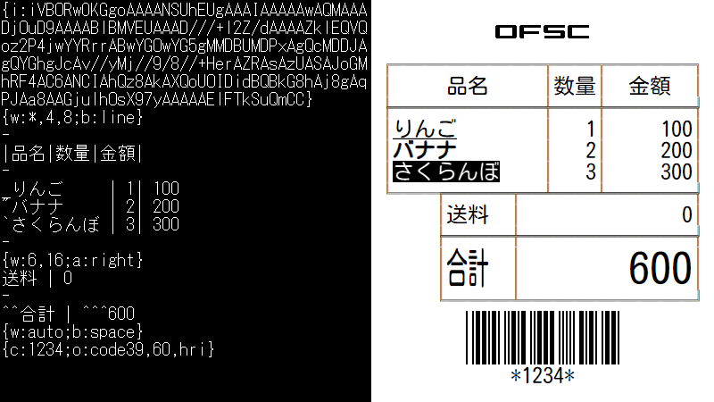  
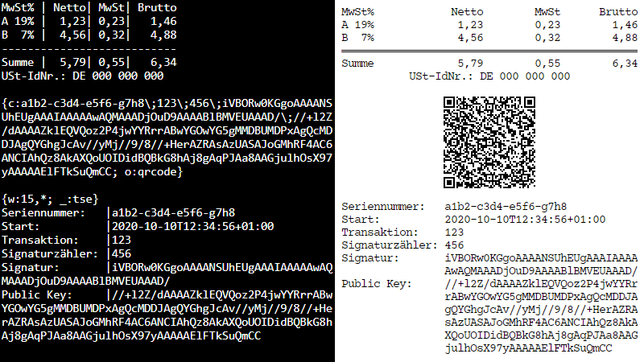  

# Features

The reference implementation of the OFSC ReceiptLine Specification.  
http://www.ofsc.or.jp/receiptline/en/  

ReceiptLine is the receipt description language that expresses the output image of small roll paper.  
It supports printing paper receipts using a receipt printer and displaying electronic receipts on a POS system or smartphone.  
It can be described simply with receipt markdown text data that does not depend on the paper width.  

This reference implementation also provides the development tool "ReceiptLine Designer" for editing, previewing, hex dumps with a virtual printer, and test printing on receipt printers.  

# Receipt Printers

- Epson TM series
- Seiko Instruments RP series
- Star MC series
- Citizen CT series
- Fujitsu FP series

Epson TM series (South Asia model) and Star MC series (StarPRNT model) can print with device font of Thai characters.  

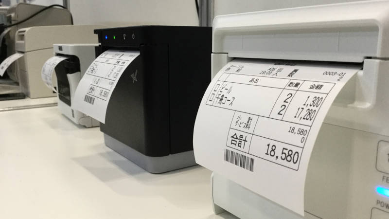  

# Installation

```bash
$ npm install receiptline
```

# Usage

`receiptline.transform()` method transforms ReceiptLine document to printer commands or SVG images.  

```javascript
const receiptline = require('receiptline');

const doc = '{code:2012345678903;option:ean,hri}';

// printer example
const printer = {
    cpl: 42,
    encoding: 'multilingual',
    upsideDown: false,
    gamma: 1.8,
    command: 'escpos'
};
const command = receiptline.transform(doc, printer);

// display example
const display = {
    cpl: 42,
    encoding: 'multilingual'
};
const svg = receiptline.transform(doc, display);
```

## Method

`receiptline.transform(doc[, printer])`  

### Parameters

- `doc`
  - a string of ReceiptLine document
- `printer`
  - an object of printer configuration

### Return value

- printer commands or SVG images

## Printer configuration

- `cpl`
  - characters per line (default: `48`)
- `encoding`
  - `multilingual`: Multilingual (including cp437, cp852, cp858, cp866, cp1252)
  - `cp437`: United States (default)
  - `cp852`: Central European
  - `cp858`: Western European
  - `cp860`: Portuguese
  - `cp863`: French Canadian
  - `cp865`: Nordic
  - `cp866`: Cyrillic
  - `cp1252`: Western European
  - `cp932`: Japanese
  - `shiftjis`: Japanese
  - `cp936`: Simplified Chinese
  - `gb18030`: Simplified Chinese
  - `cp949`: Korean
  - `ksc5601`: Korean
  - `cp950`: Traditional Chinese
  - `big5`: Traditional Chinese
  - `tis620`: Thai
- `gradient` (for printer)
  - `false`: image processing for text, barcodes, and 2D codes
  - `true`: image processing for photos (default)
- `gamma` (for printer)
  - image gamma correction (range: `0.1` - `10.0`, default: `1.8`)
- `threshold` (for printer)
  - image thresholding (range: `0` - `255`, default: `128`)
- `upsideDown` (for printer)
  - `false`: normal (default)
  - `true`: upside down
- `spacing`
  - `false`: no line spacing (default)
  - `true`: line spacing
- `cutting` (for printer)
  - `false`: no paper cutting
  - `true`: paper cutting (default)
- `margin` (for printer)
  - print margin (left) (range: `0` - `24`, default: `0`)
- `marginRight` (for printer)
  - print margin (right) (range: `0` - `24`, default: `0`)
- `command`
  - `svg`: SVG (default)
  - `text`: plain text
  - `escpos`: ESC/POS
  - `epson`: ESC/POS (Epson)
  - `sii`: ESC/POS (Seiko Instruments)
  - `citizen`: ESC/POS (Citizen)
  - `fit`: ESC/POS (Fujitsu)
  - `impact`: ESC/POS (TM-U220)
  - `impactb`: ESC/POS (TM-U220 Font B)
  - `generic`: ESC/POS (Generic) _Experimental_
  - `starsbcs`: StarPRNT (SBCS, Thai)
  - `starmbcs`: StarPRNT (Japanese)
  - `starmbcs2`: StarPRNT (Chinese, Korean)
  - `starlinesbcs`: Star Line Mode (SBCS)
  - `starlinembcs`: Star Line Mode (Japanese)
  - `starlinembcs2`: Star Line Mode (Chinsese, Korean)
  - `emustarlinesbcs`: Command Emulator Star Line Mode (SBCS)
  - `emustarlinembcs`: Command Emulator Star Line Mode (Japanese)
  - `emustarlinembcs2`: Command Emulator Star Line Mode (Chinsese, Korean)
  - `stargraphic`: Star Graphic Mode (TSP100LAN)
  - `starimpact`: Star Mode on dot impact printers _Experimental_
  - `starimpact2`: Star Mode on dot impact printers (Font 5x9 2P-1) _Experimental_
  - `starimpact3`: Star Mode on dot impact printers (Font 5x9 3P-1) _Experimental_

# Transform stream API

`receiptline.createTransform()` method is the stream version of the `receiptline.transform()`.  

```javascript
const fs = require('fs');
const receiptline = require('receiptline');

const source = fs.createReadStream('example.receipt');
const transform = receiptline.createTransform({ command: 'svg' });
const destination = fs.createWriteStream('example.svg');

source.pipe(transform).pipe(destination);
```

## Method

`receiptline.createTransform([printer])`  

### Parameters

- `printer`
  - an object of printer configuration

### Return value

- Transform stream &lt;stream.Transform&gt;

# Examples

### example/receipt/\*

Display digital receipts in the web browser and print paper receipts on the printer as needed.  

### example/cloud/\*

Print order slips from cloud server using Epson Server Direct Print or Star CloudPRNT.  

### example/nodejs/\*

Enter receipt markdown text from the web form, transform it to printer commands on the server, and print it out.  

### example/js/\*

Enter receipt markdown text from the web form, transform it to SVG images on the web browser, and display it.  

### example/data/\*

The documents (receipt markdown text) are the same as the examples in the OFSC ReceiptLine Specification.  

### example/command/\*

Customize the command object to output your own commands.  

# Libraries

### lib/receiptline.js

JavaScript ES2015(ES6) version. It works on both web browser and Node.js.  
To output printer commands on a web browser, use [Receipt.js](https://github.com/receiptline/receiptjs) or Browserify.  

```bash
$ browserify -o receiptline-full.js receiptline.js
```

### lib/qrcode-generator/qrcode.js

Generate the QR Code for display. Optional.  

# ReceiptLine Designer

Online version is available.  
https://receiptline.github.io/designer/  

The ReceiptLine Designer provides more features.  

- Edit and preview
- Data transmission via TCP socket
- Hex dump view by listening TCP 19100 port

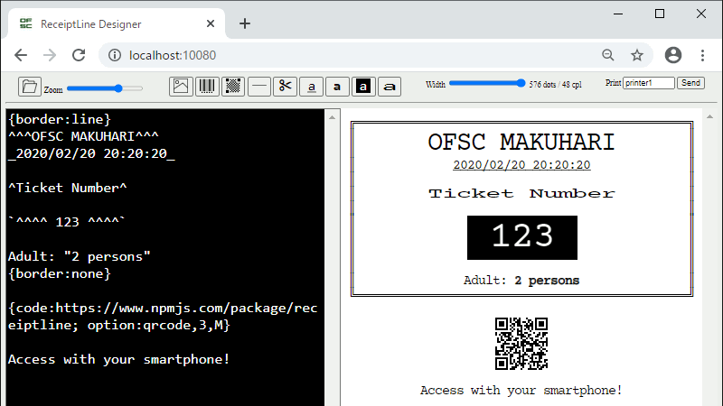  

## Setup

1. Copy the following files to your working directory

    - designer/*
    - designer.js
    - printers.json
    - servers.json

1. Start the server

    ```bash
    $ node designer.js
    ```

1. Open http://localhost:8080

    Use a modern browser.  

1. Configure printers.json

    ```json
    "printer_id": {
        "host": "127.0.0.1",
        "port": 19100,
        "asImage": false,
        "cpl": 48,
        "encoding": "shiftjis",
        "gradient": true,
        "gamma": 1.8,
        "threshold": 128,
        "upsideDown": false,
        "spacing": true,
        "cutting": true,
        "command": "escpos"
    }
    ```

    - `printer_id`
      - printer identifier (alphanumeric or underscore characters)
    - `host`
      - printer address
    - `port`
      - printer port (will be `9100`)
    - `asImage`
      - `false`: print with device font (default)
      - `true`: print as image (Requires [puppeteer](https://www.npmjs.com/package/puppeteer) or [sharp](https://www.npmjs.com/package/sharp))
    - `landscape`
      - `false`: normal (default)
      - `true`: landscape orientation (for `escpos`, `epson`, `sii`, `citizen`, `starsbcs`, `starmbcs`, `starmbcs2`)
    - `resolution`
      - print resolution for `landscape` (values: `180`, `203`, default: `203`)
    - `cpl`
    - `encoding`
    - `gradient`
    - `gamma`
    - `threshold`
    - `upsideDown`
    - `spacing`
    - `cutting`
    - `margin`
    - `marginRight`
      - see the printer configuration above
    - `command`
      - see the printer configuration above
      - `png`: PNG (Requires [puppeteer](https://www.npmjs.com/package/puppeteer) or [sharp](https://www.npmjs.com/package/sharp))

## URL query string

The designer can set initial values in the URL query string.  

### Parameters

- `z`: zoom (range: `-5`-`5`, default: `0`)
- `l`: language (`en`, `ja`, `ko`, `zh-hans`, `zh-hant`, `th`, ...)
- `c`: characters per line (range: `24`-`96`, default: `48`)
- `v`: landscape (values: `0`, `1`, default: `0`)
- `s`: line spacing (values: `0`, `1`, default: `0`)
- `p`: printer identifier (alphanumeric or underscore characters)
- `d`: ReceiptLine document

### Examples

- http://localhost:8080/index.html?c=42&p=tm_series1
- https://receiptline.github.io/designer/index.html?d={code%3A2012345678903%3Boption%3Aean%2Chri}

# Serial-LAN Converter

The serial-LAN converter enables test printing to USB / Bluetooth printers that support virtual serial ports.  

## Setup

1. Install the virtual serial port driver for the printer and [Node Serialport](https://www.npmjs.com/package/serialport)

    ```bash
    $ npm install serialport
    ```

1. Configure servers.json

    ```json
    "serial": {
        "host": "127.0.0.1",
        "port": 9100,
        "device": "COM9"
    }
    ```

    - `serial`
      - to enable it, change from `_serial`
    - `host`
      - local address
    - `port`
      - local port
    - `device`
      - the system path of the serial port
      - `<system path>[:<options>]`

    Serial port options  

    ```json
        "device": "COM9:9600,N,8,1"
    ```
    - `<options>`
      - `<baud rate>,<parity>,<data bits>,<stop bits>[,<flow control>]`
      - default: `9600,N,8,1,N`
      - commas can be omitted
    - `<baud rate>`
      - `2400`, `4800`, `9600`, `19200`, `38400`, `57600`, `115200`
    - `<parity>`
      - `N`: none, `E`: even, `O`: odd
    - `<data bits>`
      - `8`, `7`
    - `<stop bits>`
      - `1`, `2`
    - `<flow control>`
      - `N`: none, `R`: rts/cts, `X`: xon/xoff

1. Restart the server

    ```bash
    $ node designer.js
    ```

# Syntax

## Railroad diagram

**_document_**  
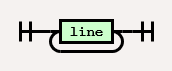  

**_line_**  
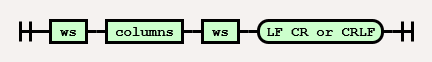  

**_columns_**  
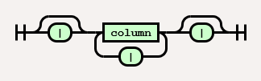  

**_column_**  
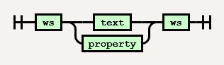  

**_text_**  
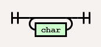  

**_char_**  
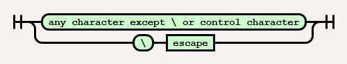  

**_escape_**  
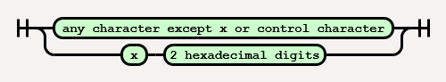  

**_ws (whitespace)_**  
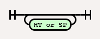  

**_property_**  
  

**_member_**  
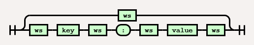  

**_key_**  
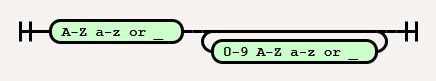  

**_value_**  
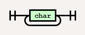  

# Grammar

## Structure

The receipt is made of a table, which separates each column with a pipe `|`.  

|Line|Content|Description|
|---|---|---|
|_column_<br><code>&#x7c;</code> _column_ <code>&#x7c;</code><br><code>&#x7c;</code> _column_<br>_column_ <code>&#x7c;</code>|Text<br>Property|Single column|
|_column_ <code>&#x7c;</code> _column_ <br><code>&#x7c;</code> _column_ <code>&#x7c;</code> _column_ <code>&#x7c;</code><br><code>&#x7c;</code> _column_ <code>&#x7c;</code> _column_<br>_column_ <code>&#x7c;</code> _column_ <code>&#x7c;</code>|Text|Double column|
|_column_ <code>&#x7c;</code> _..._ <code>&#x7c;</code> _column_<br><code>&#x7c;</code> _column_ <code>&#x7c;</code> _..._ <code>&#x7c;</code> _column_ <code>&#x7c;</code><br><code>&#x7c;</code> _column_ <code>&#x7c;</code> _..._ <code>&#x7c;</code> _column_<br>_column_ <code>&#x7c;</code> _..._ <code>&#x7c;</code> _column_ <code>&#x7c;</code>|Text|Multiple columns|

## Alignment

The column is attracted to the pipe `|` like a magnet.  
<code>&#x2423;</code> means one or more whitespaces.  

|Column|Description|
|---|---|
|_column_<br><code>&#x7c;</code>_column_<code>&#x7c;</code><br><code>&#x7c;&#x2423;</code>_column_<code>&#x2423;&#x7c;</code>|Center|
|<code>&#x7c;</code>_column_<br><code>&#x7c;</code>_column_<code>&#x2423;&#x7c;</code><br>_column_<code>&#x2423;&#x7c;</code>|Left|
|_column_<code>&#x7c;</code><br><code>&#x7c;&#x2423;</code>_column_<code>&#x7c;</code><br><code>&#x7c;&#x2423;</code>_column_|Right|

## Text

The text is valid for any column.  

```
Asparagus | 0.99
Broccoli | 1.99
Carrot | 2.99
---
^TOTAL | ^5.97
```

Characters are printed in a monospace font (12 x 24 px).  
Wide characters are twice as wide as Latin characters (24 x 24 px).  
Control characters are ignored.  

## Special characters in text

Special characters are assigned to characters that are rarely used in the receipt.  

|Special character|Description|
|---|---|
|`\`|Character escape|
|<code>&#x7c;</code>|Column delimiter|
|`{`|Property delimiter (Start)|
|`}`|Property delimiter (End)|
|`-` (1 or more, exclusive)|Horizontal rule|
|`=` (1 or more, exclusive)|Paper cut|
|`~`|Space|
|`_`|Underline|
|`"`|Emphasis|
|`` ` ``|Invert|
|`^`|Double width|
|`^^`|Double height|
|`^^^`|2x size|
|`^^^^`|3x size|
|`^^^^^`|4x size|
|`^^^^^^`|5x size|
|`^^^^^^^` (7 or more)|6x size|

## Escape sequences in text

Escape special characters.  

|Escape sequence|Description|
|---|---|
|`\\`|&#x5c;|
|<code>&#x5c;&#x7c;</code>|&#x7c;|
|`\{`|&#x7b;|
|`\}`|&#x7d;|
|`\-`|&#x2d; (Cancel horizontal rule)|
|`\=`|&#x3d; (Cancel paper cut)|
|`\~`|&#x7e;|
|`\_`|&#x5f;|
|`\"`|&#x5f;|
|``\` ``|&#x60;|
|`\^`|&#x5e;|
|`\n`|Wrap text manually|
|`\x`_nn_|Hexadecimal character code|
|`\`_char_ (Others)|Ignore|

## Properties

The property is valid for lines with a single column.  

```
{ width: * 10; comment: the column width is specified in characters }
```

|Key|Abbreviation|Value|Case-sensitive|Default|Saved|Description|
|---|---|---|---|---|---|---|
|`image`|`i`|_base64 png format_|✓|-|-|Image<br>(Recommended: monochrome, critical chunks only)|
|`code`|`c`|_textdata_|✓|-|-|Barcode / 2D code|
|`option`|`o`|_see below_|-|`code128 2 72 nohri 3 l`|✓|Barcode / 2D code options<br>(Options are separated by commas or one or more whitespaces)|
|`align`|`a`|`left`<br>`center`<br>`right`|-|`center`|✓|Line alignment<br>(Valid when line width &lt; CPL)|
|`width`|`w`|`auto`<br>`*`<br>`0` -|-|`auto`<br>(`*` for all columns)|✓|Column widths (chars)<br>(Widths are separated by commas or one or more whitespaces)|
|`border`|`b`|`line`<br>`space`<br>`none`<br>`0` - `2`|-|`space`|✓|Column border (chars)<br>(Border width: line=1, space=1, none=0)|
|`text`|`t`|`wrap`<br>`nowrap`|-|`wrap`|✓|Text wrapping|
|`command`|`x`|_textdata_|✓|-|-|Device-specific commands|
|`comment`|`_`|_textdata_|✓|-|-|Comment|

## Barcode options

Barcode options are separated by commas or one or more whitespaces.  

|Barcode option|Description|
|---|---|
|`upc`|UPC-A, UPC-E<br>(Check digit can be omitted)|
|`ean`<br>`jan`|EAN-13, EAN-8<br>(Check digit can be omitted)|
|`code39`|CODE39|
|`itf`|Interleaved 2 of 5|
|`codabar`<br>`nw7`|Codabar (NW-7)|
|`code93`|CODE93|
|`code128`|CODE128|
|`2` - `4`|Barcode module width (px)|
|`24` - `240`|Barcode module height (px)|
|`hri`|With human readable interpretation|
|`nohri`|Without human readable interpretation|

## 2D code options

2D code options are separated by commas or one or more whitespaces.  

|2D code option|Description|
|---|---|
|`qrcode`|QR Code|
|`3` - `8`|Cell size (px)|
|`l`<br>`m`<br>`q`<br>`h`|Error correction level|

## Special characters in property values

Special characters in property values are different from special characters in text.  

|Special character|Description|
|---|---|
|`\`|Character escape|
|<code>&#x7c;</code>|Column delimiter|
|`{`|Property delimiter (Start)|
|`}`|Property delimiter (End)|
|`:`|Key-value separator|
|`;`|Key-value delimiter|

## Escape sequences in property values

Escape special characters.  

|Escape sequence|Description|
|---|---|
|`\\`|&#x5c;|
|<code>&#x5c;&#x7c;</code>|&#x7c;|
|`\{`|&#x7b;|
|`\}`|&#x7d;|
|`\;`|&#x3b;|
|`\n`|New line|
|`\x`_nn_|Hexadecimal character code|
|`\`_char_ (Others)|Ignore|

# Restrictions

- Communication with the printer, status event processing, and error handling are out of scope.
- SVG images depend on the font family installed on the computer and may not display properly.
- Impact printer has some limitations for printing.
  - Characters larger than 2x size
  - Inverted characters (**will be printed in red**)
  - Double height characters in different colors on the same line
  - Multibyte characters
  - Image position and size ratio
  - Barcodes and 2D codes
- Star Graphic Mode printing only supports images, line feeds, and paper cuts.
- [sharp](https://www.npmjs.com/package/sharp) is not support web fonts and minimizes the area of "invert" character decoration.

# Author

Open Foodservice System Consortium  
http://www.ofsc.or.jp/  

# License

- ReceiptLine
  - Apache License, Version 2.0
- QR Code Generator for JavaScript with UTF8 Support
  - MIT License
